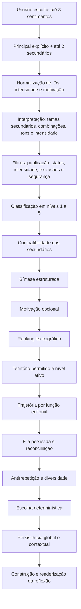

# Algoritmo atual e sincronicidade com o acervo

> Documento técnico, editorial e conceitual vivo do projeto Entre Sábios. Ele descreve o estado comprovado nesta análise; não autoriza nem implementa as evoluções propostas.

## 1. Identificação da análise

| Item | Estado verificado em 16/07/2026 |
|---|---|
| Branch | `agent/finaliza-loop-estabilizacao` |
| HEAD | `7876aa46f264a327442aa01e6f169ea333ac6ddf` |
| Acervo-mestre | `entre_sabios_acervo_mestre_final.json`, versão de conteúdo `definitiva-2.1` |
| Runtime | esquema `1.1.0`, 283 conteúdos ativos: 64 núcleos, 151 contextuais e 68 gerais |
| Sentimentos | 14 |
| Seletor | esquema de fila `2`; política de rotação `2` |
| Sínteses | catálogo `1.2.0`: 29 pares direcionais revisados e 1 tríade explícita |
| Testes desta verificação | estado histórico anterior à `DEC-034`; a validação atual está registrada nos testes e relatórios V2 |
| Escopo | estado emocional, elegibilidade, segurança, ranking, síntese, motivação, trajetória, rotação, persistência, acervo ativo e apresentação |
| Alterações funcionais | nenhuma |

### Limitações

- Os dez cenários foram reproduzidos diretamente com o runtime e os adaptadores de produção, em memória, sem navegação visual. Assim, suas seleções são evidência do motor, não uma nova validação de layout ou interação real.
- `npm test` recompôs os arquivos de runtime de maneira determinística antes de executar os testes. O conteúdo resultante permaneceu idêntico no Git.
- Relatórios de fases anteriores são evidência histórica. Quando divergem do código ou dos totais atuais, prevalecem o código, o runtime e os testes atuais.
- Métricas de qualidade editorial indicam distribuição e cobertura; não provam, sozinhas, a experiência subjetiva de uma pessoa.
- O repositório já estava com alterações locais alheias a esta tarefa. Elas não foram incluídas, revertidas nem interpretadas como parte desta análise.

### Legenda de evidência

- **IMPLEMENTADO NO CÓDIGO**: existe caminho executável ativo.
- **REPRESENTADO NOS DADOS**: existe campo ou perfil no acervo/catálogo.
- **COBERTO POR TESTE**: há asserção automatizada específica.
- **OBSERVADO NO NAVEGADOR**: constou em validação Playwright ou manual documentada.
- **PARCIALMENTE IMPLEMENTADO**: o mecanismo existe, mas dados, alcance ou integração são incompletos.
- **SOMENTE CONCEITUAL**: não existe contrato executável correspondente.
- **PROPOSTA FUTURA**: sugestão, sem autorização de implementação.
- **NÃO COMPROVADO**: a evidência disponível não sustenta a afirmação.

## 2. Resumo executivo

O algoritmo atual é uma **curadoria determinística hierárquica com filtragem de segurança, ranking lexicográfico, trajetória e rotação persistente**. Ele combina classificação, filtro, ranking, percurso e antirrepetição. Não é aleatório, não é um chatbot e não usa IA remota em produção.

Sua inteligência real está na composição de regras explícitas:

1. mantém o sentimento principal soberano;
2. elimina conteúdo inativo, não publicável, incompatível com intensidade ou inseguro;
3. classifica o restante em cinco níveis de associação;
4. usa secundários, síntese e motivação apenas para ordenar candidatos já elegíveis;
5. escolhe uma função editorial adequada ao momento da sequência;
6. preserva filas e históricos para percorrer o território antes de repetir;
7. relaxa preferências de diversidade antes de admitir repetição exata;
8. grava a escolha antes da renderização.

As decisões são determinísticas: ordenação lexicográfica, hash estável, filas persistidas e regras fixas. A sensação de variedade vem do percurso da fila e do histórico, não de sorteio. A precisão depende diretamente dos metadados do acervo: associações, placement, intensidade, temas, tom, função editorial, riscos, exclusões, formato e autoria.

O que o sistema **não** faz: não infere sentimentos a partir de texto livre; não diagnostica; não gera frases; não aprende pesos com curtidas; não usa preferência pessoal de autoria; não calcula embeddings; não inventa autoria; não garante que toda síntese específica tenha abundância de conteúdos igualmente específicos.

Os principais limites são editoriais: 255 dos 283 itens são `frase`; somente 10 são formatos desenvolvidos (`microtexto`, `reflexao_curta` ou `citacao_longa`); 121 itens têm função `contemplation`, contra apenas 3 `inquiry` e 2 `grounding`; e os campos de equivalência canônica aceitos pelo motor não chegam ao runtime atual. Portanto, o motor protege bem o principal e a repetição literal, mas a variedade de formato, função e fragmento depende de uma cobertura que ainda é desigual.

## 3. Identidade e arquitetura do algoritmo

### Nome descritivo recomendado

**Motor determinístico de percurso editorial por território emocional.**

O nome é adequado porque:

- “motor” indica uma cadeia de regras executáveis;
- “determinístico” diferencia o sistema de geração por IA e de sorteio puro;
- “percurso” descreve filas, histórico, progressão de nível e trajetória;
- “editorial” reconhece que função, tom, segurança e acervo curado são centrais;
- “território emocional” descreve a soberania do principal e os secundários como refinamento.

Ele é mais que filtro por tags porque ordena, acompanha sequência e evita repetição. É menos que um recomendador semântico: não aprende representações nem entende texto novo. É diferente de um chatbot porque seleciona conteúdo fechado e aprovado, sem gerar resposta.

### Componentes ativos

| Responsabilidade | Arquivo/função principal | Estado |
|---|---|---|
| Estado escolhido | `js/core/emotional-state.js`: `normalizeEmotionalSelection`, `interpretEmotionalState` | **IMPLEMENTADO / TESTADO** |
| Controle do principal e secundários | `js/ui/feelings-ui.js`: seleção inicial e `setPrimaryFeeling` | **IMPLEMENTADO / TESTADO** |
| Resolução de síntese | `js/core/emotional-synthesis.js`: resolvedor local | **IMPLEMENTADO / TESTADO** |
| Sinal da síntese no ranking | `js/core/synthesis-ranking-adapter.js` | **IMPLEMENTADO / TESTADO** |
| Preferência de motivação | `js/core/motivation-ranking-adapter.js` | **IMPLEMENTADO / TESTADO** |
| Elegibilidade, ranking e rotação | `js/core/runtime-engine.js` | **IMPLEMENTADO / TESTADO** |
| Orquestração da seleção | `js/core/matching.js`: `pickRuntimeContent` | **IMPLEMENTADO / TESTADO** |
| Construção da reflexão e inicialização | `script.js`: `buildRuntimeStory`, `generateReflection`, `newPhrase`, `init` | **IMPLEMENTADO / TESTADO** |
| Renderização | `js/ui/reflection-ui.js` | **IMPLEMENTADO / TESTADO** |
| Fonte de produção | `data/entre_sabios_runtime.js/json` gerado por `scripts/content-build-lib.mjs` | **IMPLEMENTADO / TESTADO** |

## 4. Fluxo completo real

### 4.1 Seleção e estado normalizado

- **Entrada atual:** sentimentos selecionados, principal explícito e intensidade resolvida pela progressão interna da `DEC-034`; motivação não participa do fluxo ativo.
- **Saída:** principal, até dois secundários, intensidade válida, chave direcional estável e contrato de seleção.
- **Regra:** o primeiro sentimento vira principal; depois ele só muda por remoção ou ação explícita de foco. A ordem dos secundários é normalizada para a chave, sem trocar o principal.
- **Fallback:** intensidade ausente ou inválida permanece `null`, sem elegibilidade, temas ou tons; motivação é desligada se não há principal.
- **Evidência:** `emotional-state.js`; `feelings-ui.js`; `color-analogy-contract.test.mjs`; `interface-wiring.test.mjs`; `behavioral-selection.test.mjs`.
- **Risco:** o sistema só conhece escolhas declaradas; não infere contexto além delas.

### 4.2 Interpretação emocional

`interpretEmotionalState` cria temas dos secundários a partir de `feelingsCatalog`, temas de combinações a partir de `combinationRules`, temas e tons da intensidade a partir de `intensityProfiles`. O principal também tem taxonomia, embora o nível de associação continue sendo decidido pelas associações do conteúdo.

**IMPLEMENTADO NO CÓDIGO / REPRESENTADO NOS DADOS.** A interpretação transforma a seleção em sinais estruturados; não produz diagnóstico psicológico.

### 4.3 Elegibilidade e segurança

`rankEligibleContents` elimina antes do ranking itens não publicáveis, status inativo, intensidade incompatível, exclusões duras e efeitos editoriais inseguros. `getContextSignals` distingue primeira resposta e alguns estados intensos. `classifyEditorialEffects` combina metadados e padrões conservadores de risco.

Estados vulneráveis (`luto`, `tristeza`, `inseguranca`, `culpa`, `ansiedade`, `solidao`) têm proteção adicional. Em intensidade intensa, o conjunto se amplia também para `falta_de_proposito` e `raiva`. Pressão por superação, conselho prematuro, culpabilização, moralização, agressividade e romantização são riscos bloqueados; ação e confronto são restringidos quando inadequados.

**COBERTO POR TESTE:** `vulnerable-motivation-safety.test.mjs`, `behavioral-selection.test.mjs` e `runtime-selection.test.mjs`.

### 4.4 Níveis de associação

`getSelectionLevel` classifica cada candidato:

1. associação do principal em `nucleo`;
2. associação do principal em `contextual`;
3. associação de secundário em `nucleo`;
4. associação de secundário em `contextual`;
5. `placement: geral`.

Há uma distinção decisiva: os cinco níveis existem como **representação e diagnóstico**, mas `getPermittedLevels` permite `[1,2]` quando o melhor nível é 1 e apenas o próprio melhor nível nos demais casos. Assim, se há território principal, níveis 3 a 5 não entram na circulação ativa. Secundários e gerais só assumem o território quando não existe candidato melhor ligado ao principal. Isso preserva a soberania do principal.

### 4.5 Secundários, síntese e motivação

`getSecondaryCompatibility` dá maior prioridade a associação secundária de núcleo que contextual e acrescenta correspondência de temas de secundários, combinação, intensidade e tom. Esse critério vem depois do nível.

O resolvedor de síntese procura, nesta ordem: tríade exata, par direcional exato, perfil do principal com modificadores, fallback cauteloso e estado sem síntese. O adaptador converte apenas sinais estruturados em vetor `[tema, função, tom]`; não lê o resumo humano para pontuar.

O adaptador histórico de motivação permanece como evidência isolada, mas não é carregado nem passado ao seletor de produção desde a `DEC-034`.

### 4.6 Ranking lexicográfico

A ordem relevante é: nível de associação → compatibilidade dos secundários → vetor da síntese → vetor da motivação → desempate estável. Não existe soma em que muitos pontos secundários possam vencer um nível principal. Essa propriedade é a proteção central contra dominância dos secundários.

### 4.7 Trajetória, fila e escolha final

A trajetória ordena funções editoriais de acordo com a posição da sequência. Na abertura, favorece `recognition`, `presence`, `contemplation`, `clarification`, `grounding`, `inquiry`, `reframing`, `confrontation`, `action`. Depois, tende a `clarification`, `inquiry`, `grounding`, `reframing`, `contemplation`, `recognition`, `presence`, `action`, `confrontation`. Estados intensos iniciais podem permanecer no padrão protetivo.

O seletor reconcilia uma fila persistida com os candidatos atuais. Dentro do nível ativo, evita ID, texto normalizado, equivalência canônica disponível, texto quase duplicado, conceito recente e autor recente; também tenta cadência de formatos. Preferências são relaxadas de modo controlado. A repetição exata só é admitida quando todo o território permitido foi percorrido, registrada como `all_allowed_candidates_exhausted`.

A escolha é gravada no histórico global e contextual antes de retornar ao chamador. `matching.js` registra diagnóstico opcional; `script.js` constrói a história; `reflection-ui.js` mostra apenas blocos com conteúdo específico.

## 5. Filtros rígidos e preferências

| Classe | Regra atual | Pode ser relaxada? | Evidência |
|---|---|---:|---|
| Filtro rígido | `publicationEnabled` e status publicável | Não | build + `runtime-engine.js` |
| Filtro rígido | intensidade em `suitableIntensities` | Não | `rankEligibleContents` |
| Filtro rígido | `hardExclusions` acionada pelo contexto | Não | `isBlocked` |
| Filtro rígido | efeitos/riscos inseguros | Não | `classifyEditorialEffects` |
| Gate hierárquico | território do principal/níveis permitidos | Não enquanto houver território principal | `getSelectionLevel`, `getPermittedLevels` |
| Restrição de ciclo | ID, texto ou chave canônica já percorrido | Só após esgotamento comprovado | `select`, contrato de candidatos |
| Preferência | associação e temas dos secundários | Sim | `getSecondaryCompatibility` |
| Preferência | síntese `[tema, função, tom]` | Sim; política reduz sinais em ambiguidade | adaptador de síntese |
| Preferência | motivação | Sim; neutra sem sinal forte | adaptador de motivação |
| Preferência | função da trajetória | Sim | `getTrajectoryPriority` |
| Preferência | texto quase duplicado e conceito recente | Sim antes da repetição exata | rotação |
| Preferência | autor recente | Sim quando necessário | janela de 5 autores |
| Preferência | cadência de formato | Sim quando o conjunto é pequeno | cadência desenvolvida |

Autoria e referência documental não são filtros emocionais do seletor. A autoria participa da diversidade; fonte e classificação editorial participam de rastreabilidade e apresentação. Não há preferência pessoal por autor.

## 6. Analogia das cores

A analogia está **implementada como contrato estrutural**, não como cálculo cromático nem apenas como visual.

| Aspecto | Estado real | Influência | Teste/risco |
|---|---|---|---|
| Principal como cor dominante | Campo explícito e nível soberano | Forte | Todos os pares e tríades preservam principal; baixo risco de secundário vencer |
| Secundários como tonalidades/contrastes | Até dois campos e temas derivados | Equilibrada, dentro do nível | Podem ter efeito pequeno quando faltam metadados compatíveis |
| Intensidade como profundidade | Campo próprio; filtra compatibilidade e segurança | Forte como filtro, não como “peso emocional” | Combinações podem ficar com poucos candidatos em intensa |
| Síntese como mistura | Pares direcionais, tríade, `relationType` e adaptador | Limitada por confiança/ambiguidade | 29 pares e 1 tríade; outras combinações usam fallback honesto |
| Motivação como direção desejada | Booleano e perfil separado | Fraca/subordinada | Não cria cor, sentimento ou elegibilidade |

Exemplos reais:

- **Principal sozinho:** não há bloco de síntese; o principal continua decidindo níveis.
- **Amor + Medo:** `amor__medo`, relação `ambivalence`; o primeiro conteúdo observado foi `batch01-quote-016`, nível 1.
- **Autoconhecimento + Confusão + Insegurança:** tríade exata `tension`; secundários em ordem inversa produzem a mesma chave ordenada e o mesmo perfil.
- **Medo + Amor:** a inversão produz `medo__amor`, relação `context`, e outro território: apenas 5 candidatos principais permitidos em intensa.
- **Motivação ligada:** em Falta de propósito + Confusão houve `motivationFallback: true`; nenhum núcleo tinha correspondência motivacional forte, e o sistema não fingiu precisão.
- **Intensidade:** Luto + Saudade moderada tinha 68 candidatos ranqueados na medição auxiliar; em intensa, com segurança e intensidade reais, restaram 18, dos quais 10 no território permitido.

Combinações diferentes ainda podem produzir resultados semelhantes porque o principal e a função de reconhecimento dominam, e porque o acervo tem alta concentração de frases contemplativas. Isso é limite de cobertura, não falha da analogia.

## 7. Âncora, Espelho, Clareira e Navalha

Nenhum desses quatro nomes é campo, enum ou classe executável. Eles são **SOMENTE CONCEITUAIS como taxonomia nominal**, mas partes de suas funções aparecem com outros nomes.

| Conceito | Implementado? | Equivalente atual | Evidência | Limitações |
|---|---|---|---|---|
| Âncora | Parcial, com outro nome | `presence`, `grounding`, `recognition`; tom acolhedor; regras de segurança | trajetória e `classifyEditorialEffects` | runtime tem 2 `grounding` e não possui `presence` como função principal; cobertura baixa |
| Espelho | Parcial, com outro nome | `recognition`, `contemplation` | 59 recognition e 121 contemplation; prioridade inicial | pode dominar sequências vulneráveis e parecer repetitivo |
| Clareira | Parcial, com outro nome | `clarification`, `inquiry`, `reframing` | 44, 3 e 33 itens respectivamente; prioridade posterior | `inquiry` é escasso e a passagem não é garantida em conjuntos pequenos |
| Navalha | Parcial e fortemente condicionada | `confrontation`, parte de `reframing`, tom confrontador lúcido | 12 confrontations; prioridade tardia; bloqueios intensos | não é direção explícita; inadequada no início de luto, tristeza intensa e outros estados vulneráveis |

Âncora é adequada sobretudo à abertura e à intensidade alta; Espelho à nomeação inicial e investigação sem julgamento; Clareira à progressão moderada; Navalha somente quando segurança, intensidade e sequência permitem. O algoritmo não “escolhe uma Navalha”; ele pode chegar a um conteúdo de confronto depois de filtros e trajetória. Logo, ocorrências são inferidas, não formalizadas.

## 8. Trajetória editorial atual

A trajetória funciona **por sequência**, não apenas por seleção isolada. O histórico contextual informa se a escolha é primeira resposta e quais funções já circularam. A primeira seleção pede reconhecimento inicial; depois a prioridade se desloca para clarificação, pergunta, aterramento e reenquadramento. A sequência conhece o que já ofereceu por ID, texto, conceitos, autor, formato e função registrada.

Ela não é um roteiro clínico nem linear obrigatório. Trocar combinação ou intensidade muda a chave contextual, mas o histórico global continua impedindo retorno precoce. A motivação pode reordenar a fila remanescente; não reinicia ciclo nem salta filtros.

### Riscos restantes

- **Sempre acolher:** provável quando um sentimento intenso tem quase só `recognition` seguro; Saudade + Luto intensa apresentou 10/10 permitidos de recognition.
- **Confrontar cedo:** protegido em estados intensos e vulneráveis; em moderada, a trajetória ainda depende dos metadados corretos.
- **Repetir função:** possível e às vezes inevitável pela concentração do acervo.
- **Interromper trajetória:** a troca de contexto cria outra fila contextual, embora preserve novidade global.
- **Motivação artificial:** mitigada pelo requisito de duas dimensões e pelo fallback; no cenário obrigatório motivado ela não encontrou sinal forte.

### Comparação com um percurso futuro

O percurso reconhecimento → amparo → clareza → ampliação → movimento → confronto cuidadoso é compatível, mas parte dele já existe. Reconhecimento é `recognition`; amparo combina segurança, `presence`/`grounding` e tom; clareza é `clarification`/`inquiry`; ampliação é `reframing`; movimento é `action`; confronto é `confrontation`. Criar um segundo motor duplicaria a trajetória. O que falta é cobertura editorial e métricas por etapa, não necessariamente novos nomes.

Luto, tristeza intensa e culpa não devem cumprir uma escada obrigatória. Podem precisar voltar a reconhecimento, permanecer em presença ou nunca chegar a ação/confronto durante uma sessão curta.

## 9. Circulação e rotação

- **Fila ativa:** por versão, principal, secundários ordenados, intensidade e nível.
- **Histórico global:** até 120 registros, preservado entre contextos e recargas.
- **Histórico contextual:** até 120 por chave emocional.
- **Janela recente:** 12 conteúdos para bloqueio imediato; 5 autores para diversidade.
- **Progressão:** percorre o melhor nível; se começou no nível 1, avança ao 2 antes de repetir.
- **Reconciliação:** remove IDs inválidos, preserva a ordem restante e acrescenta novos candidatos; mudança incompatível de esquema/política reconstrói só a rotação.
- **Ciclo:** ID, texto normalizado e chaves canônicas disponíveis são excluídos enquanto houver alternativa permitida inédita.
- **Repetição inevitável:** somente após esgotar todo o território permitido; fica documentada no diagnóstico.

Secundários são considerados tanto na classificação de níveis 3/4 quanto, principalmente, como refinamento dos níveis 1/2. Conteúdo geral só circula se o melhor nível disponível for 5; ele não é um reservatório automático após o contextual quando existe território principal.

Os testes atuais demonstram cobertura integral antes de repetição, persistência em recarga, retorno a combinação anterior sem apagar histórico, textos normalizados, quase duplicatas, autoria e conceitos. O relatório de estresse registrou 800 seleções sem repetição evitável e 100% de cobertura antes de repetir.

## 10. Sincronicidade inteligente

Definição operacional: **capacidade de alinhar o estado escolhido, o momento da sequência, a segurança necessária, a disponibilidade real do acervo, a novidade e a direção editorial, escolhendo uma reflexão adequada sem geração por IA.**

| Dimensão | Avaliação | Evidência e limite |
|---|---|---|
| Adequação | **forte** | principal soberano; 546 pares ordenados e 6.552 cenários com dois secundários testados sem perda do principal |
| Tonalidade | **razoável** | secundários e síntese refinam ranking; influência histórica mediana 0,1075, mas metadados/cobertura variam |
| Profundidade | **razoável** | intensidade filtra e protege; não mede profundidade semântica do texto |
| Momento | **razoável** | primeira resposta, função e histórico atuam; escassez de funções pode achatar o percurso |
| Segurança | **forte** | filtros independentes de motivação; testes específicos para vulnerabilidade e luto intenso |
| Novidade | **forte para texto/ID; fraca para fragmento canônico** | ciclo e janela funcionam; runtime não transporta equivalências editoriais |
| Variedade | **fraca a razoável** | autoria circula, mas 90,1% do acervo é `frase` e funções são concentradas |
| Continuidade | **forte** | histórico global sobrevive a intensidade, combinação, motivação e recarga |
| Disponibilidade | **razoável** | diagnóstico mostra candidatos, níveis e fallback; não há limiar editorial de “qualidade suficiente” além da elegibilidade |
| Honestidade | **forte** | síntese cautelosa e motivação neutra quando faltam sinais; nenhum texto é inventado |

O algoritmo já produz sincronicidade determinística, especialmente em adequação, segurança e novidade literal. Ela é menos precisa em tonalidade, variedade e trajetória quando o acervo oferece poucos sinais ou formatos.

## 11. Como algoritmo e acervo trabalham juntos

| Campo | Função real | Usado onde | Impacto | Cobertura atual | Problema |
|---|---|---|---|---:|---|
| `associations` | sentimento + núcleo/contextual | níveis e secundários | muito alto | 215/283 não vazios; gerais ficam vazios | é a fonte principal do território |
| `placement` | geral/núcleo/contextual editorial | nível 5 e build | alto | 283/283 | para níveis 1–4 prevalecem associações |
| `primaryFeeling` | verdade editorial derivada/histórica | build e auditoria | indireto | 215/283 | seletor usa associações, não este campo isolado |
| `secondaryFeeling` | metadado editorial | build/auditoria | baixo direto | 40/283 | granularidade limitada; associações são mais importantes |
| `suitableIntensities` | compatibilidade | filtro rígido | muito alto | 283/283 | pode reduzir fortemente conjuntos intensos |
| `editorialFunction` | trajetória | ordenação | alto | 283/283 | 121 contemplation; 3 inquiry; 2 grounding |
| `secondaryFunction` | classificação editorial auxiliar | praticamente não entra no seletor | baixo | 44/283 | campo pouco aproveitado pelo motor atual |
| `tone` | síntese, motivação e compatibilidade | adaptadores/ranking | médio | 283/283 | concentração em contemplativo (112) |
| `themes` | secundários, síntese, motivação e conceitos | ranking/rotação | médio-alto | 227/283 não vazios | 56 ativos sem tema; temas genéricos podem bloquear diversidade excessivamente |
| `riskTags` | segurança | filtro | crítico quando presente | 29/283 não vazios | ausência não significa automaticamente segurança; há classificação por efeitos |
| `hardExclusions` | contexto/primeira resposta/intensa | filtro | crítico | 17/283 não vazios | depende de sinais de contexto limitados |
| `displayType` | cadência de formato e UI | rotação/apresentação | médio | 283/283 | 255 frases; apenas 10 formatos desenvolvidos |
| autor/`displayedAuthor` | diversidade e crédito | rotação/UI | médio | 283/283 | autoria agregada “Entre Sábios” concentra alguns cenários |
| fonte/status de fonte | rastreabilidade | UI/auditoria | editorial | estruturado no runtime | não é sinal emocional de ranking |
| `status`/`publicationEnabled` | publicação | filtro/build | crítico | 283/283 | consistente no runtime |
| `duplicateOf` | equivalência no mestre | validação e suporte potencial | nulo em produção | 7/344 no mestre; 0 runtime | build compacto remove o campo |
| `canonicalContentId`, `derivedFromId`, `sourceFragmentId` | equivalência aceita pelo motor | antirrepetição | potencialmente alto | 0 runtime | suporte de código sem dados de produção |
| `conceptGroup` | diagnóstico potencial | não dirige conceitos atuais | nulo | 0 runtime | conceitos são inferidos de `themes` |
| sinais motivacionais | perfis externos sobre tema/função/tom | adaptador | baixo e subordinado | perfis revisados para 6 principais + default | não são campos novos por conteúdo |

### Desalinhamentos comprovados

1. **Equivalência:** o motor lê campos canônicos, o mestre só possui 7 `duplicateOf` e o build não os leva ao runtime. A proteção real em produção cai para ID, texto normalizado, quase duplicata e temas.
2. **Formato:** o motor possui cadência de 20–30% quando há ao menos três desenvolvidos compatíveis, mas o acervo inteiro possui apenas 10 desenvolvidos.
3. **Trajetória:** há uma sequência rica de funções no código, mas `presence` não aparece como função principal no runtime, e `inquiry`/`grounding` são raros.
4. **Síntese:** descrições direcionais são específicas, porém o conteúdo selecionável pode continuar genérico se temas, funções e tons não cobrem a combinação.
5. **Motivação:** o mecanismo é seguro, mas os perfis fortes são poucos; 26 de 133 cenários auditados tiveram alteração e 23 eram intensos. Isso é preferência discreta, não transformação garantida.

## 12. Modelo de cooperação algoritmo–acervo

Um modelo honesto deve preservar a arquitetura existente:

1. **Elegibilidade:** publicação, status, intensidade, exclusões e segurança.
2. **Adequação principal:** nível do principal; nunca compensado por soma de secundários.
3. **Tonalidade:** associações secundárias, temas de combinação e síntese estruturada.
4. **Intensidade e segurança:** já ocorre antes das preferências; manter assim.
5. **Trajetória:** escolher função apropriada dentro do conjunto seguro e principal.
6. **Novidade:** bloquear conteúdo exato/equivalente enquanto houver alternativa.
7. **Diversidade:** autor, conceito e formato como preferências relaxáveis.
8. **Disponibilidade real:** medir tamanho e composição do território, sem criar pesos para esconder lacunas.
9. **Fallback honesto:** reduzir especificidade, preservar principal e declarar no diagnóstico; nunca inventar texto ou autoria.

O algoritmo não deve compensar falta editorial com pesos cada vez mais complexos. O acervo, por sua vez, não precisa ter todos os conteúdos em todas as combinações: precisa cobrir os territórios prioritários com funções e formatos suficientes.

## 13. Dez cenários reais

Medição: runtime `definitiva-2.1`, adaptadores de síntese e motivação ativos, armazenamento limpo por cenário, primeira resposta no primeiro clique e quatro “Outra perspectiva” seguintes. “Ranqueados” inclui todos os níveis conceituais; “permitidos” é o território efetivamente circulável. Os IDs abaixo são resultados determinísticos desta medição.

### 13.1 Autoconhecimento + Confusão + Insegurança, moderada

- **Síntese/relação:** tríade exata, `tension`, confiança alta/ambiguidade média; investigação de identidade atravessada por dúvida e autoimagem.
- **Níveis:** 1: 4; 2: 37; 3: 13; 4: 16; 5: 66. Ranqueados 136; permitidos 41 (níveis 1–2).
- **Funções/formatos:** 24 contemplation, 5 clarification, 4 reframing, 3 confrontation; 37 frases, 3 citações curtas, 1 reflexão curta.
- **Autores:** distribuição ampla; maiores grupos com 3 itens cada (Platão, Jiddu Krishnamurti e Montaigne, em versões inspiradas).
- **Sequência:** `batch02-quote-005` → `curated-44` → `batch01-quote-026` → `batch03-quote-002` → `batch02-quote-038`.
- **Trajetória:** Espelho/Clareira; chega a confronto moderado no quarto núcleo e clarificação contextual no quinto.
- **Fallback/risco:** sem fallback de síntese; risco de excesso contemplativo e de a tríade editorialmente específica operar sobre muitos contextuais genéricos.

### 13.2 Luto + Saudade, intensa

- **Síntese/relação:** par exato `reinforcement`, confiança alta/ambiguidade baixa; ausência e vínculo continuado.
- **Níveis:** 1: 8; 2: 2; 3: 7; 5: 1. Ranqueados 18; permitidos 10.
- **Funções/formatos:** 9 recognition e 1 clarification; 9 frases e 1 reflexão curta.
- **Autores:** 5 “Entre Sábios”; C. S. Lewis aparece em 2.
- **Sequência:** `curated-113` → `batch04-quote-024` → `batch04-quote-026` → `ANT-LUT-002` → `batch04-quote-021`.
- **Trajetória:** Âncora + Espelho. Segurança impede pressão por superação.
- **Fallback/risco:** síntese específica; conjunto estreito e autoria agregada concentrada. Pouca possibilidade de Clareira sem abandonar a segurança.

### 13.3 Saudade + Luto, intensa

- **Síntese/relação:** par direcional exato `reinforcement`, confiança/ambiguidade médias; memória com irreversibilidade.
- **Níveis:** 1: 7; 2: 3; 3: 5; 4: 2; 5: 1. Ranqueados 18; permitidos 10.
- **Funções/formatos:** todos os 10 permitidos são recognition; 9 frases e 1 reflexão curta.
- **Autores:** Emily Dickinson e C. S. Lewis com 3 cada no território.
- **Sequência:** `batch04-quote-009` → `batch04-quote-031` → `batch04-quote-025` → `Fernando Pessoa-1` → `batch04-quote-029`.
- **Trajetória:** Espelho/Âncora quase puro.
- **Fallback/risco:** sem fallback de síntese, mas há lacuna funcional objetiva: a trajetória não pode progredir enquanto permanecer nesse território intenso.

### 13.4 Amor + Medo, moderada

- **Síntese/relação:** par exato `ambivalence`; aproximação e vulnerabilidade diante de perda/rejeição.
- **Níveis:** 1: 5; 2: 19; 3: 2; 4: 7; 5: 66. Ranqueados 99; permitidos 24.
- **Funções/formatos:** 8 recognition, 8 reframing, 4 contemplation, 3 clarification, 1 action; 23 frases e 1 citação curta.
- **Autores:** Simone Weil 4; Clarice, Kundera e Fromm 3 cada.
- **Sequência:** `batch01-quote-016` → `batch04-quote-011` → `batch04-quote-023` → `batch01-quote-029` → `curated-07`.
- **Trajetória:** começa Espelho; há potencial de Clareira após esgotar os cinco núcleos.
- **Risco:** formato extremamente uniforme; a tonalidade do medo depende mais de temas e síntese que de variedade estrutural.

### 13.5 Medo + Amor, intensa

- **Síntese/relação:** par exato `context`; medo é centro, amor explica o peso afetivo.
- **Níveis:** 1: 3; 2: 2; 3: 5; 4: 11; 5: 1. Ranqueados 22; permitidos somente 5.
- **Funções/formatos:** 3 recognition e 2 clarification; 4 frases e 1 citação curta; cinco autores distintos.
- **Sequência:** `batch02-quote-010` → `batch06-quote-022` → `batch07-quote-029` → `batch01-quote-030` → `batch06-quote-014`.
- **Trajetória:** Espelho → Clareira cuidadosa.
- **Risco:** repetição torna-se inevitável no sexto clique se o contexto não mudar; disponibilidade pequena, apesar de boa diversidade de autoria.

### 13.6 Falta de propósito + Confusão, moderada, com motivação

- **Síntese/relação:** par exato `context`; sentido/direção atravessados por necessidade de clareza.
- **Níveis:** 1: 3; 2: 10; 3: 4; 4: 17; 5: 66. Ranqueados 100; permitidos 13.
- **Motivação:** nenhum candidato do melhor nível apresentou sinal forte; `motivationFallback: true`. A preferência não alterou elegibilidade.
- **Funções/formatos:** 4 reframing, 4 contemplation, 3 recognition, 2 clarification; 11 frases, 1 microtexto e 1 citação curta.
- **Autores:** 3 conteúdos “Entre Sábios”; demais mais dispersos.
- **Sequência:** `ANT-MICRO-PRO-001` → `ANT-PRO-002` → `ANT-PRO-001` → `batch07-quote-015` → `batch01-quote-036`.
- **Trajetória:** Espelho, depois Clareira; o microtexto aparece imediatamente.
- **Risco/lacuna:** motivação solicitada é honestamente neutra; falta cobertura forte no núcleo para que a direção motivacional seja perceptível.

### 13.7 Tristeza + Solidão, intensa

- **Síntese/relação:** par exato `reinforcement`; sofrimento e ausência percebida de amparo.
- **Níveis:** 1: 8; 2: 2; 3: 5; 4: 2; 5: 1. Ranqueados 18; permitidos 10.
- **Funções/formatos:** 8 recognition, 1 clarification, 1 reframing; 9 frases e 1 microtexto.
- **Autores:** 8/10 aparecem como “Entre Sábios”.
- **Sequência:** `ANT-MICRO-TRI-001` → `ANT-TRI-005` → `ANT-TRI-007` → `ANT-TRI-003` → `ANT-TRI-002`.
- **Trajetória:** Âncora/Espelho; pequena abertura de Clareira.
- **Risco:** alta concentração de crédito e função pode ser percebida como repetição mesmo sem repetir texto.

### 13.8 Raiva + Culpa, moderada

- **Síntese/relação:** par exato `tension`; limite e responsabilidade sem invalidar a raiva.
- **Níveis:** 1: 2; 2: 10; 3: 1; 4: 10; 5: 66. Ranqueados 89; permitidos 12.
- **Funções/formatos:** 4 contemplation, 3 clarification, 3 reframing, 2 recognition; 11 frases e 1 reflexão curta.
- **Autores:** Audre Lorde e Aristóteles com 2; demais dispersos.
- **Sequência:** `batch03-quote-012` → `batch06-quote-011` → `curated-09` → `Carl Jung-1` → `batch05-quote-002`.
- **Trajetória:** Espelho → Clareira; não há Navalha explícita entre os cinco primeiros, apesar da relação de tensão.
- **Risco:** a síntese promete tensão produtiva, mas o território permitido não contém `confrontation`; isso é prudente, porém mostra distância entre descrição e direção disponível.

### 13.9 Ansiedade + Medo, intensa

- **Síntese/relação:** par exato `reinforcement`; antecipação ansiosa e ameaça possível.
- **Níveis:** 1: 2; 2: 5; 3: 3; 4: 2; 5: 1. Ranqueados 13; permitidos 7.
- **Funções/formatos:** 3 reframing, 2 recognition, 2 grounding; todos são frases; sete autores distintos.
- **Sequência:** `batch03-quote-022` → `Michel de Montaigne-1` → `Marco Aurélio-3` → `Epicteto-1` → `Nisargadatta Maharaj-2`.
- **Trajetória:** Espelho → Âncora → Clareira. É o cenário intenso com percurso funcional mais claro.
- **Risco:** ausência total de formatos desenvolvidos e apenas sete alternativas antes do esgotamento.

### 13.10 Esperança + Luto, moderada

- **Síntese/relação:** par exato `tension`, confiança alta; possibilidade convivendo com perda.
- **Níveis:** 1: 2; 2: 11; 3: 8; 4: 3; 5: 66. Ranqueados 90; permitidos 13.
- **Funções/formatos:** 6 contemplation, 3 clarification, 2 recognition, 2 reframing; 11 frases e 2 citações curtas; autoria dispersa.
- **Sequência:** `batch04-quote-002` → `batch04-quote-034` → `batch03-quote-008` → `batch07-quote-002` → `batch01-quote-030`.
- **Trajetória:** Espelho → Clareira, com cautela para não transformar esperança em cobrança.
- **Risco:** a esperança pode soar como superação prematura se os metadados de risco forem insuficientes; os filtros atuais reduzem esse risco, mas revisão humana continua necessária.

## 14. Problemas recorrentes e estado atual

| Categoria/problema | Evidência | Estado/correção | Risco restante | Origem |
|---|---|---|---|---|
| Principal enfraquecido | regressões antigas e matriz atual | **corrigido/testado** por nível lexicográfico | baixo | algoritmo |
| Secundário dominante | testes com dois secundários | **não reproduzido**; nível precede bônus | baixo | algoritmo |
| Secundário sem efeito | influência mínima histórica 0,0289 | **parcial** | combinações com poucos sinais parecem iguais | acervo + metadados |
| Combinação genérica | 153/182 pares sem perfil específico em auditoria histórica | **conhecido**; fallback cauteloso | médio | catálogo editorial |
| Repetição precoce/fila reiniciada | testes reais, recarga e estresse | **corrigido/testado** | repetição inevitável em conjunto pequeno | disponibilidade |
| Mesmo autor | janela e limite em equivalentes | **mitigado** | “Entre Sábios” concentra territórios vulneráveis | acervo |
| Mesmo conceito/fragmento | temas e suporte canônico | **parcial** | runtime sem equivalências canônicas | build/acervo |
| Acolhimento repetido | cenários intensos de saudade/luto | **observado** | trajetória plana | acervo |
| Confronto precoce | regras e testes intensos | **corrigido/testado** | metadado incorreto ainda seria risco | ambos |
| Motivação artificial | requisito de 2 sinais; fallback | **mitigado** | efeito frequentemente imperceptível | cobertura |
| Pressão/romantização/culpa | riscos e efeitos | **testado** | duas pendências herdadas de luto constam em auditoria, bloqueadas no caminho seguro | acervo + segurança |
| Poucos formatos | 255 frases; 10 desenvolvidos | **não corrigido** | variedade visual/editorial baixa | acervo |
| Lacunas funcionais | 3 inquiry; 2 grounding; 0 presence principal | **não corrigido** | trajetória teórica maior que a real | acervo |

## 15. Métricas recomendadas

Métricas devem permanecer diagnósticas; não virar pesos automaticamente.

| Métrica | Cálculo sugerido | Já existe? | Uso/risco |
|---|---|---|---|
| Retenção do principal | seleções nível 1/2 ÷ seleções com território principal | sim, testes/auditoria | detectar regressão; 100% pode ocultar conjunto pobre |
| Influência do secundário | mudança de ordenação dentro do mesmo nível | sim, auditoria | medir tonalidade; não confundir mudança com qualidade |
| Dominância secundária | escolha fora do principal causada por secundários | sim, teste | deve permanecer zero quando há principal |
| Especificidade da síntese | tríade/par/perfil/fallback por cenário | parcial | priorizar revisão; perfil específico não garante conteúdo específico |
| Efeito da motivação | posições alteradas sem mudar elegibilidade | sim, relatório | não maximizar: preferência deve ser discreta |
| Cobertura antes de repetir | únicos permitidos vistos ÷ território permitido | sim | deve ser 100% antes de repetição exata |
| Concentração de candidatos | tamanho do território e participação do top nível | sim, diagnóstico | conjunto grande não garante diversidade semântica |
| Concentração de autores | maior participação e streak | sim | autoria agregada pode distorcer leitura |
| Concentração de conceitos | frequência de `conceptKeys` em janela | parcial | temas incompletos tornam a métrica frágil |
| Taxa de fallback | motivação/síntese sem perfil forte | sim, diagnóstico | fallback é honestidade, não falha automática |
| Variedade funcional | entropia/distribuição de funções por território | proposta | útil para trajetória; não impor equilíbrio artificial |
| Progressão | distância entre funções consecutivas e estágios | parcial | não presumir trajetória linear em vulneráveis |
| Diversidade de formatos | formatos distintos e proporção desenvolvida | sim em testes condicionais | não forçar texto longo em estado inadequado |
| Disponibilidade | permitidos por principal/intensidade/combinação | sim, auditoria | definir alerta editorial, não resgate inseguro |
| Equivalência canônica | cobertura de fragmentos/derivações no runtime | não efetiva | só medir após contrato editorial confiável |

## 16. Sugestões realistas e priorizadas

### A. Sem alterar o acervo

| Sugestão | Problema/evidência | Impacto | Esforço/risco | Arquivos/teste |
|---|---|---|---|---|
| Painel/relatório de disponibilidade por território | conjuntos de 5–13 em cenários intensos | alto diagnóstico | baixo/muito baixo | script de auditoria; teste de saída; sem produção |
| Métrica de trajetória por sequência real | funções concentradas | médio | baixo/baixo | diagnóstico do seletor; testes de não interferência |
| Relatório explícito de relaxamentos | difícil saber por que autor/conceito/formato cedeu | médio | médio/baixo | diagnóstico/replay; garantir sequência idêntica |
| Teste de contrato runtime × suporte canônico | motor aceita campos que build descarta | alto preventivo | baixo/baixo | build e teste, sem preencher dados |
| Matriz contínua dos dez cenários deste documento | evitar regressões circulares | alto | baixo/baixo | testes de seleção, sem fixar um autor como qualidade |

### B. Pequena revisão editorial

| Sugestão | Evidência | Impacto | Esforço/risco | Dependência |
|---|---|---|---|---|
| Revisar equivalências comprovadas já marcadas por `duplicateOf` | 7 no mestre, 0 runtime | alto para repetição por fragmento | médio/médio | decidir contrato e preservação no build |
| Revisar metadados dos poucos `inquiry` e `grounding` | 3 e 2 ativos | médio | baixo/médio | revisão humana individual |
| Auditar territórios intensos com 5–10 permitidos | Medo+Amor, Luto+Saudade | alto | médio/baixo | relatório de disponibilidade |
| Validar temas vazios em ativos | 56/283 sem temas | médio | médio/médio | não preencher automaticamente |

### C. Para a futura revisão do acervo

- aumentar, somente onde a métrica comprovar lacuna, funções de clarificação, pergunta, aterramento e reenquadramento seguro;
- criar mais microtextos/reflexões curtas em territórios que hoje são quase só frases;
- diversificar autoria/crédito em tristeza, solidão, luto e saudade sem sacrificar adequação;
- mapear fragmentos canônicos e derivações com revisão documental;
- revisar combinações prioritárias cuja síntese é específica, mas o território selecionável permanece genérico;
- ampliar sinais motivacionais apenas onde houver conteúdo editorialmente adequado, sem criar otimismo obrigatório.

### D. Não recomendado agora

- IA em tempo real, embeddings ou banco vetorial: custo, opacidade e risco editorial sem lacuna técnica que os exija;
- novo motor “Âncora/Espelho/Clareira/Navalha”: duplicaria funções e trajetória existentes;
- pesos numéricos aprendidos com curtidas: ameaça principal soberano, previsibilidade e diversidade;
- reclassificação automática em massa: risco alto para segurança e autoria;
- geração automática de frases, sínteses ou autores: incompatível com o acervo fechado e rastreável;
- dezenas de novos campos antes de medir os atuais: aumentariam inconsistência sem benefício comprovado;
- progressão linear obrigatória: inadequada para luto, culpa e tristeza intensa.

## 17. Os quatro conceitos como sistema futuro

| Modelo | Clareza/precisão | Esforço/risco | Acervo | Recomendação |
|---|---|---|---|---|
| A — não formalizar | técnica alta, nomes menos intuitivos | baixo/baixo | nenhuma mudança | seguro, mas perde linguagem editorial acessível |
| B — mapear sobre funções existentes | boa, admite funções híbridas | baixo a médio/baixo | tabela editorial opcional | **melhor equilíbrio**, se houver uso real em auditoria/UI interna |
| C — camada explícita | alta apenas se curada item a item | alto/médio-alto | novo campo e revisão ampla | não justificado agora |

O Modelo B é preferível se os nomes ajudarem editores: Âncora pode mapear presença/grounding/recognition; Espelho, recognition/contemplation; Clareira, clarification/inquiry/reframing; Navalha, confrontation/reframing condicionado. O mapeamento deve permitir combinações, como Espelho + pequena Clareira. Não deve alterar ranking até demonstrar ganho.

## 18. Plano de evolução realista

### Etapa 1 — compreender e estabilizar

- **Objetivo:** preservar principal, segurança, persistência e sequência.
- **Alterações:** apenas regressões concretas e testes.
- **Fora de escopo:** novos metadados e reclassificação.
- **Aceite:** 257 testes atuais, cenários reais e navegador sem regressão.
- **Risco:** produzir diff sem defeito; deve ser evitado.

### Etapa 2 — medir

- **Objetivo:** disponibilidade, fallback, circulação, trajetória, autor, conceito e formato.
- **Alterações:** auditorias e diagnóstico sem influenciar produção.
- **Aceite:** saída reproduzível e separação entre falha e lacuna editorial.
- **Risco:** transformar distribuição em nota de qualidade.

### Etapa 3 — ajustar uso do acervo existente

- **Objetivo:** melhorar diagnóstico, relaxamento e suporte a equivalência já comprovada.
- **Alterações:** mínimas, com comparação antes/depois.
- **Fora de escopo:** criar conteúdo.
- **Aceite:** ganho mensurável sem perda de principal, segurança ou cobertura.

### Etapa 4 — revisão editorial futura

- **Objetivo:** preencher lacunas comprovadas de função, formato, tema e fragmento.
- **Alterações:** lotes pequenos, revisão humana e rebuild controlado.
- **Aceite:** cobertura melhora sem inflar associações genéricas.
- **Risco:** classificar tudo para tudo e enfraquecer o significado do núcleo.

### Etapa 5 — expansão controlada

- **Objetivo:** novos conteúdos somente para territórios ainda insuficientes.
- **Aceite:** autoria/fonte rastreáveis, segurança, testes e métrica de necessidade.
- **Risco:** quantidade sem diversidade editorial real.

## 19. Riscos técnicos e editoriais

1. Confundir o total ranqueado com o conjunto circulável e concluir, incorretamente, que gerais sempre entram após contextuais.
2. Alterar pesos para corrigir uma lacuna que pertence ao acervo.
3. Fixar IDs esperados em testes como se uma frase específica fosse sempre a “melhor”, congelando a curadoria sem necessidade.
4. Usar conceitos de cor ou Navalha como diagnóstico psicológico apresentado ao usuário.
5. Levar equivalências incompletas ao runtime e bloquear conteúdos distintos por erro editorial.
6. Forçar diversidade de autor/formato acima de segurança e adequação.
7. Tratar fallback como defeito e inventar precisão.
8. Criar uma segunda trajetória paralela e desfazer decisões aprovadas.

## 20. Conclusões obrigatórias

- **Método real:** motor determinístico de percurso editorial por território emocional, combinando filtros rígidos, níveis hierárquicos, ranking lexicográfico, trajetória, fila e antirrepetição.
- **Analogia das cores:** está implementada como estrutura: principal dominante, secundários como refinamento, intensidade separada, síntese direcional e motivação subordinada. Não é um cálculo cromático.
- **Âncora, Espelho, Clareira e Navalha:** não são entidades formais; funções equivalentes existem parcialmente. O comportamento atual é predominantemente Espelho, com Âncora em vulnerabilidade, Clareira na progressão e Navalha tardia/condicionada.
- **Formalização:** não criar um novo motor. Se os nomes forem úteis, mapear editorialmente sobre funções existentes, sem ranking novo.
- **Trajetória:** conhece o momento pela primeira resposta, histórico contextual e funções anteriores; não segue uma escada obrigatória.
- **Uso do acervo:** associações e intensidade determinam território/segurança; temas, função e tom refinam; autor, conceito e formato diversificam; status e publicação controlam entrada.
- **Desalinhamento central:** o código tem mecanismos mais ricos que a cobertura de funções, formatos e equivalências do runtime.
- **Melhoria sem acervo:** medir disponibilidade/relaxamento/trajetória e proteger o contrato canônico com testes, sem mudar ranking por conjectura.
- **O que deve esperar:** preenchimento de temas, funções, formatos, combinações e equivalências requer revisão editorial humana.
- **Sincronicidade honesta:** preservar segurança e principal, usar sinais estruturados, percorrer novidades, medir disponibilidade e assumir fallback quando não há resposta ideal.
- **Maior impacto e menor risco:** criar diagnóstico reproduzível por território e sequência, incluindo cobertura funcional, formato, fallback e equivalência. Isso identifica onde agir sem alterar o que já funciona.

## 21. Glossário

- **Território principal:** candidatos associados ao principal em núcleo ou contextual.
- **Nível ativo:** nível que a fila percorre no momento.
- **Ranqueado:** candidato que passou filtros e recebeu nível, mesmo que seu nível não esteja permitido na circulação atual.
- **Permitido/elegível no contrato:** candidato em nível que pode circular naquele contexto.
- **Síntese:** descrição e sinais estruturados da relação direcional entre sentimentos.
- **Fallback:** redução explícita de especificidade quando não há perfil/sinal suficiente.
- **Trajetória:** prioridade de funções editoriais conforme o momento da sequência.
- **Ciclo:** percurso do território permitido antes de repetir conteúdo exato/equivalente.
- **Chave direcional:** principal seguido de secundários normalizados; inverter o principal muda a chave.
- **Sincronicidade inteligente:** alinhamento determinístico entre estado, momento, segurança, acervo e novidade.

## 22. Referências verificadas

### Governança e decisões

`AGENTS.md`, `PROJECT_STATUS.md`, `DECISIONS.md`, `DOCUMENTACAO_ENTRE_SABIOS.md`, `REGISTRO_PROBLEMAS_RECORRENTES.md`, `MATRIZ_AUTORIDADE_HISTORICOS.md`, `PADRAO_EDITORIAL_ENTRE_SABIOS.md`.

### Relatórios de estabilização

`relatorios/finais/RELATORIO_FINAL_LOOP_ALGORITMO_MAPA_EMOCIONAL.md`, `relatorios/fases/RELATORIO_FASE_10_AUDITORIA_SISTEMATICA.md`, `relatorios/fases/RELATORIO_FASE_11_TESTES_ESTRESSE.md`, `relatorios/fases/RELATORIO_FASE_12_NAVEGADOR_E_DISPOSITIVOS.md`, `relatorios/fases/RELATORIO_FASE_13_REGRESSAO_EDITORIAL.md`.

### Código e dados

`script.js`; `js/core/emotional-state.js`; `js/core/emotional-synthesis.js`; `js/core/matching.js`; `js/core/runtime-engine.js`; `js/core/synthesis-ranking-adapter.js`; `js/core/motivation-ranking-adapter.js`; `js/data/emotional-syntheses.js`; `js/data/motivation-profiles.js`; `js/data/catalogs.js`; `js/ui/feelings-ui.js`; `js/ui/reflection-ui.js`; `scripts/content-build-lib.mjs`; `entre_sabios_acervo_mestre_final.json`; `data/entre_sabios_runtime.json`.

### Testes consultados e/ou executados na suíte

`behavioral-selection.test.mjs`, `candidate-contract.test.mjs`, `color-analogy-contract.test.mjs`, `content-runtime.test.mjs`, `diagnostic-replay.test.mjs`, `emotional-state-contract.test.mjs`, `emotional-synthesis.test.mjs`, `interface-wiring.test.mjs`, `motivation-control.test.mjs`, `motivation-ranking.test.mjs`, `phase9-rotation-integration.test.mjs`, `queue-migration.test.mjs`, `repetition-real-path-regression.test.mjs`, `runtime-selection.test.mjs`, `selection-progression.test.mjs`, `synthesis-interface.test.mjs`, `synthesis-ranking.test.mjs`, `systematic-audit.test.mjs`, `vulnerable-motivation-safety.test.mjs` e a suíte completa `tests/*.test.mjs`.

---

**Regra de manutenção:** antes de mudar este documento, comparar código, runtime, testes e decisões canônicas. Propostas não devem ser descritas como capacidades atuais; relatórios históricos não devem prevalecer sobre a implementação ativa.
